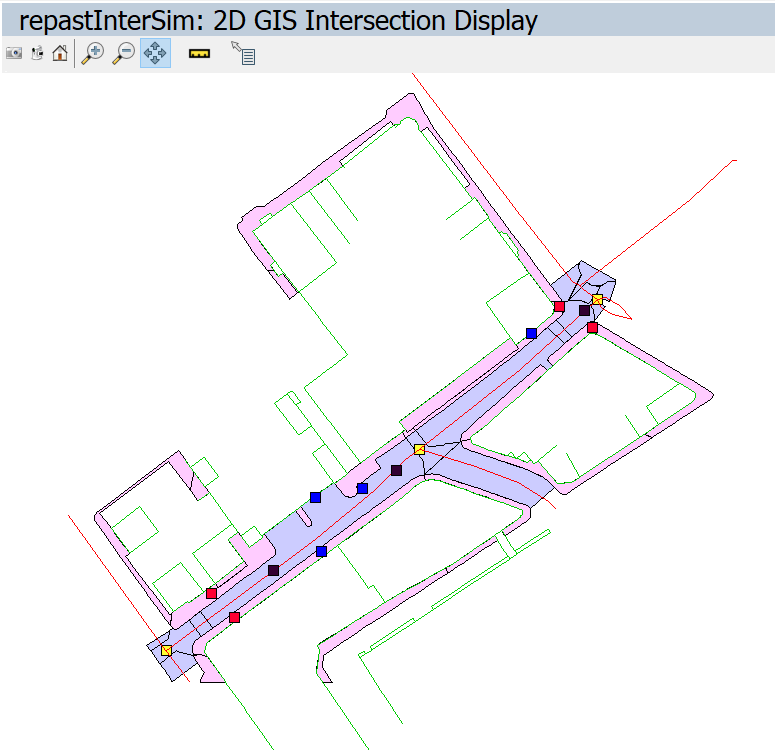
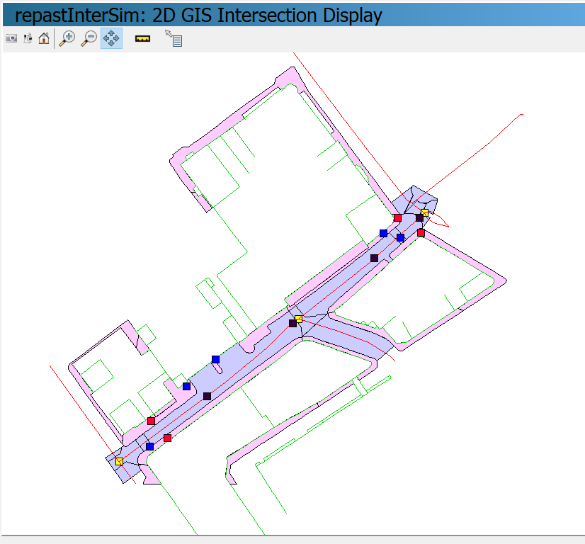

# Multi-scale Pedestrian Navigation

This is a Repast Simphony agent-based model (ABM) of pedestrian and vehicle movement in an urban road network.

The objective of this ABM is to model neighbourhood level pedestrian movement with sufficient detail to represent road crossing behaviour that is compliant (pedestrians walk along pavements and crossing at established crossings) and non-compliant (pedestrians cross at locations and at times that minimise their journey time).

To so this we integrate route choice decisions at the street level with decisions at the neighbourhood level. Specifically, we model a pedestrian's choice of where to cross the road (street level) and integrate this with route choices over multiple road links (neighbourhood level). We draw on Construal Level Theory to inform how these decisions are integrated.

These behaviours are of interest for two main reasons. Firstly, producing pedestrian agents that have heterogeneous and spatiotemporally varying road crossing behaviour improves the detail of simulations of pedestrian mobility which could improve the planning of pedestrian infrastructure. Secondly, models of diverse road crossing behaviour provide a good environment for testing models of pedestrian-vehicle interaction which are being developed for Autonomous Vehicles.

[Here is a short talk about this work](https://www.youtube.com/watch?v=QUFn5B0Pa2I)

*A screenshot for the model, showing pedestrians in blue and vehicles in black. Note how a pedestrian agent is crossing the road at a location outside of the 'crossings' (the two small rectangle sections of the road). This behaviour is non-compliant*

*Another screenshot, this time showing compliant pedestrian behaviour.*

## Acknowledgements

This project makes use of the respastCity project by Nick Malleson: https://github.com/nickmalleson/repastcity. 

You can read more about the repastCity project (including its license) here: https://github.com/nickmalleson/repastcity/blob/master/repastcity3/documentation/intro/repastcity3.txt